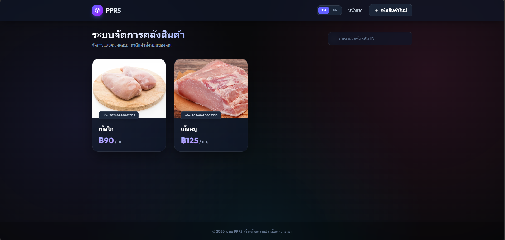
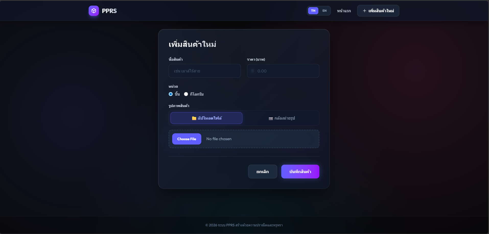

# 📦 PPRS - Product Price Recording System

> [!NOTE]
> **[English](#english) | [ภาษาไทย](#thai)**

---

<a name="english"></a>

## 🇬🇧 English Version

### Description
**PPRS (Product Price Recording System)** is a specialized inventory and price management system designed for small grocery stores or local shops. It prioritizes simplicity combined with a modern **Premium Glassmorphism** aesthetic to make managing products efficient and visually stunning.

### ✨ Key Features
- **🎨 Premium UI/UX**: Aesthetic Glassmorphism Dark Mode design, modern, and eye-friendly.
- **🌍 Bilingual Support**: Fully supports **Thai and English** with persistent language settings via Cookies.
- **📸 Camera Integration**: Capture product photos directly from your browser/mobile camera or upload existing image files.
- **🔍 Live Search**: Instant real-time filtering by product name or ID.
- **⚖️ Flexible Units**: Supports multiple selling units: "Pieces" or "Kilograms".
- **📱 Responsive Design**: Seamless experience across Desktop, Tablet, and Mobile devices.
- **🚀 High Performance**: Built on Bun and ElysiaJS for lightning-fast response times.

### 🛠️ Tech Stack
- **Runtime**: [Bun](https://bun.sh/)
- **Backend Framework**: [ElysiaJS](https://elysiajs.com/)
- **Frontend Styling**: [Tailwind CSS v4](https://tailwindcss.com/)
- **UI Components**: Vanilla HTML/JS with Glassmorphism
- **Database**: JSON-based File Storage (Easy backup, no DB setup required)
- **Notifications**: SweetAlert2

### 🚀 Getting Started
1. **Install Dependencies**: Ensure [Bun](https://bun.sh/) is installed.
   ```bash
   bun install
   ```
2. **Run Development Server**:
   ```bash
   bun run dev
   ```
3. **Access the App**: Open [http://localhost:3000](http://localhost:3000)

### 📸 Screenshots

*Modern Glassmorphism Inventory View*


*Product Creation with Camera Integration*

---

<a name="thai"></a>

## 🇹🇭 ภาษาไทย (Thai Version)

### รายละเอียด
**PPRS (Product Price Recording System)** คือระบบจัดการและจดบันทึกราคาสินค้าที่ออกแบบมาเพื่อร้านค้าขายของชำหรือร้านค้าขนาดเล็กโดยเฉพาะ เน้นความเรียบง่าย แต่มาพร้อมกับดีไซน์ที่ทันสมัยระดับพรีเมียม (**Premium Glassmorphism**) เพื่อให้การจัดการคลังสินค้าเป็นเรื่องง่ายและสวยงาม

### ✨ คุณสมบัติเด่น
- **🎨 Premium UI/UX**: ดีไซน์แบบ Glassmorphism Dark Mode ที่สวยงาม ทันสมัย และสบายตา
- **🌍 Bilingual Support**: รองรับ 2 ภาษา (**ไทย และ อังกฤษ**) พร้อมระบบจำค่าภาษาที่เลือกไว้ผ่าน Cookies
- **📸 Camera Integration**: สามารถถ่ายรูปสินค้าจากกล้องมือถือ/คอมพิวเตอร์ได้ทันที หรือจะอัปโหลดจากไฟล์ภาพก็ได้
- **🔍 Live Search**: ค้นหาสินค้าด้วยชื่อหรือรหัส (ID) แบบ Real-time พิมพ์ปุ๊บเจอรายละเอียดปั๊บ
- **⚖️ Flexible Units**: รองรับหน่วยสินค้าทั้งแบบ **"ชิ้น"** และ **"กิโลกรัม"**
- **📱 Responsive Design**: ใช้งานได้ลื่นไหลทุกอุปกรณ์ ทั้งบนคอมพิวเตอร์ แท็บเล็ต และมือถือ
- **🚀 High Performance**: พัฒนาด้วย Bun และ ElysiaJS มั่นใจได้ในความเร็วและการตอบสนองที่ฉับไว

### 🛠️ Tech Stack
- **Runtime**: [Bun](https://bun.sh/)
- **Backend Framework**: [ElysiaJS](https://elysiajs.com/)
- **Frontend Styling**: [Tailwind CSS v4](https://tailwindcss.com/)
- **UI Components**: Vanilla HTML/JS with Glassmorphism
- **Database**: JSON-based File Storage (ง่ายต่อการสำรองข้อมูลและไม่ต้องติดตั้ง Database เพิ่มเติม)
- **Notifications**: SweetAlert2

### 🚀 การติดตั้งและเริ่มใช้งาน
1. **ติดตั้ง Dependencies**: ตรวจสอบให้แน่ใจว่าคุณติดตั้ง [Bun](https://bun.sh/) เรียบร้อยแล้ว
   ```bash
   bun install
   ```
2. **รันโปรเจกต์ (Development Mode)**:
   ```bash
   bun run dev
   ```
3. **เข้าใช้งาน**: เปิดเบราว์เซอร์ไปที่ [http://localhost:3000](http://localhost:3000)

### 📸 ภาพตัวอย่างหน้าจอ

*มุมมองคลังสินค้าแบบ Glassmorphism*


*หน้าเพิ่มสินค้าพร้อมระบบถ่ายภาพ*

---

**Crafted with Precision & Elegance**